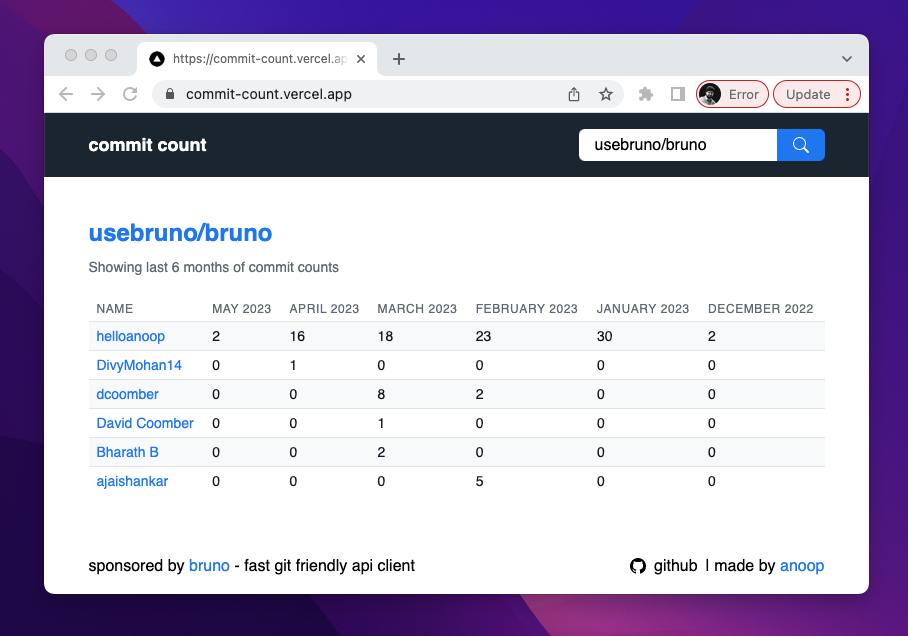

# commit-count
A site that displays userwise commit count of the repo since the last 6 months.

[Visit Website](https://commit-count.vercel.app/)

## Demo

# Todo
- [ ] Support repo name to be passed a query param
- [ ] refactor axios code for fetching commits
- [ ] better error handling in ux

### Licence
[MIT](license.md)
